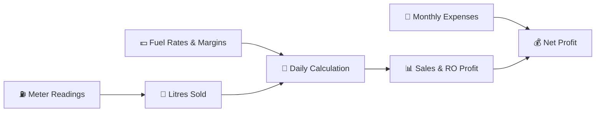

<div align="center">

# 🛢️ Easy Manager

### **The digital operating register for Indian petrol pump owners.**

Manage **meter readings, fuel rates, expenses & profitability** from one focused workspace.

<br/>


<br/>

**Built for the real daily workflow of a fuel station — not generic accounting software.**

</div>

---

## ⛽ What is Easy Manager?

**Easy Manager** is a mobile-first vertical SaaS application designed around the operational workflow of Indian petrol pump businesses.

Instead of keeping meter readings, fuel rates, expenses and calculations scattered across registers and spreadsheets, Easy Manager brings them together and turns daily operational data into **sales, RO margin and monthly profitability reports**.

### The idea

> **Record once. Calculate automatically. Understand the business.**

---

## ✨ What It Does

| 🧾 Daily Operations | 📈 Business Visibility |
|---|---|
| Record MS & HSD meter readings | Today's sales & fuel volume |
| Carry forward previous closing readings | RO / dealer profit |
| Manage fuel rates & margins | Monthly expenses |
| Track operating expenses | Monthly net profit |
| Detect meter continuity issues | Historical reports |
| Detect missing fuel rates | Multi-business workspaces |

---

## 🧠 Built Around Petrol Pump Logic

Easy Manager isn't just CRUD forms with a dashboard.

It understands the relationship between **meter readings → fuel rates → litres → sales → dealer margin → expenses → profit**.



### Supported fuel types

- **MS** — Motor Spirit / Petrol
- **HSD** — High-Speed Diesel

### Core calculations

```text
Net Litres
= (Closing Meter - Opening Meter) - Testing Litres

Sales Revenue
= Net Litres × Selling Rate

RO Gross Margin
= Net Litres × Dealer Margin per Litre

Net Profit
= Total RO Gross Margin - Total Monthly Expenses
```

---

## 🚦 Smart Operational Checks

Easy Manager doesn't only store numbers — it highlights data that may need attention.

**Missing Fuel Rate**

> Financial figures can be incomplete when a reading has no applicable rate.

**Meter Continuity Mismatch**

> Flags readings where an opening number doesn't match the previous closing number.

**Invalid Meter Values**

> Prevents a closing reading from being lower than its opening reading.

**Future-Dated Readings**

> Reading dates are validated against the business date in Asia/Kolkata.

---

## 🏢 Multi-Business by Design

One owner can manage multiple independent business workspaces.

```text
👤 Owner
│
├── ⛽ Business / Pump A
│   ├── Readings
│   ├── Fuel Rates
│   ├── Expenses
│   └── Reports
│
├── ⛽ Business / Pump B
│   ├── Readings
│   ├── Fuel Rates
│   ├── Expenses
│   └── Reports
│
└── 🚚 Other Business
    └── ...
```

Every operational record is associated with a `business_id`, while **Supabase Row Level Security (RLS)** provides the database-level tenant boundary.

---

## 🏗️ Architecture

```text
┌──────────────────────────────────────────────┐
│                  Next.js App                 │
│                                              │
│  App Router • React • TypeScript             │
│  Server Components • Server Actions          │
└──────────────────────┬───────────────────────┘
                       │
              ┌────────▼────────┐
              │ Validation Layer │
              │      Zod        │
              └────────┬────────┘
                       │
              ┌────────▼────────┐
              │ Supabase Client │
              │      SSR        │
              └────────┬────────┘
                       │
              ┌────────▼────────┐
              │ PostgreSQL      │
              │ + RLS           │
              └────────┬────────┘
                       │
          ┌────────────▼────────────┐
          │ Reporting Views         │
          │ daily_sales_view        │
          │ monthly_profit_        │
          │ summary_view            │
          └─────────────────────────┘
```

### Key architectural decisions

- **Next.js App Router** for the application structure.
- **Server Actions** for business mutations.
- **Zod** for server-side input validation.
- **Supabase Auth** for authentication.
- **PostgreSQL + RLS** for persistent, tenant-isolated data.
- **PostgreSQL views** as the calculation/reporting source of truth.
- `security_invoker = true` on reporting views so database security policies remain respected.
- Centralized database queries under `lib/queries/`.

---

## 🛠️ Tech Stack

| Layer | Technology |
|---|---|
| Framework | Next.js App Router |
| Language | TypeScript |
| Frontend | React |
| Styling | Tailwind CSS |
| UI Components | shadcn/ui + Radix UI |
| Icons | Lucide React |
| Database | Supabase PostgreSQL |
| Authentication | Supabase Auth |
| SSR | `@supabase/ssr` |
| Validation | Zod |
| Security | PostgreSQL Row Level Security |
| Reporting | PostgreSQL Views |

---

## 📂 Project Structure

```text
easy-manager/
│
├── app/
│   ├── actions/                 # Server Actions
│   ├── auth/                    # Authentication flows
│   └── protected/
│       └── dashboard/
│           ├── create/          # Business creation
│           └── [businessId]/
│               ├── readings/    # Meter register
│               ├── rates/       # Fuel rates & margins
│               ├── expenses/    # Monthly expenses
│               └── reports/     # Sales & profit reports
│
├── components/
│   ├── business/
│   ├── dashboard/
│   ├── expenses/
│   ├── rates/
│   ├── readings/
│   ├── reports/
│   └── ui/
│
├── lib/
│   ├── queries/                 # Database query layer
│   ├── supabase/                # Supabase clients
│   ├── date.ts                  # Business date utilities
│   ├── types.ts                 # TypeScript types
│   └── utils.ts
│
├── supabase/
│   ├── config.toml
│   └── migrations/              # Version-controlled SQL
│
├── .env.example
├── AGENTS.md
├── package.json
└── README.md
```

---

## 🚀 Run It Locally

### 1. Clone

```bash
git clone https://github.com/omsahuhai/easy-manager.git
cd easy-manager
```

### 2. Install

```bash
npm install
```

### 3. Configure Supabase

```bash
cp .env.example .env.local
```

Add:

```env
NEXT_PUBLIC_SUPABASE_URL=https://your-project.supabase.co
NEXT_PUBLIC_SUPABASE_PUBLISHABLE_KEY=your-supabase-publishable-key
```

### 4. Apply migrations

```bash
npx supabase db push
```

### 5. Start development

```bash
npm run dev
```

Then open `http://localhost:3000`.

---

## 📜 Scripts

```bash
npm run dev       # Development server
npm run build     # Production build
npm run start     # Production server
npm run lint      # ESLint
```

---

## 🔐 Security Model

Easy Manager follows a **database-first security model**.

```text
Authentication
     ↓
Authenticated User
     ↓
Business Workspace
     ↓
business_id
     ↓
PostgreSQL RLS
     ↓
Authorized Records Only
```

Important principles:

- Authentication is handled by Supabase Auth.
- Operational records are scoped to `business_id`.
- RLS protects tenant data at the database layer.
- Server Actions validate user input with Zod.
- Database constraints provide an additional integrity layer.
- Service-role credentials must never be exposed to the client.

---

## 🎯 Product Philosophy

Easy Manager is intentionally focused.

It is not trying to become an all-in-one ERP on day one.

The core product loop is:

**Record → Calculate → Detect → Understand**

The long-term direction is to move from digital record keeping toward **operational intelligence for fuel-station owners**.

Possible future areas include staff roles, stronger anomaly detection, performance comparisons, automated summaries and additional workflow integrations.

> These are product directions, not claims about features currently available.

---

## 🧑‍💻 For Developers

When extending Easy Manager:

1. Keep important business rules server-side.
2. Validate user-controlled input with Zod.
3. Preserve `business_id` tenant isolation.
4. Keep financial calculations centralized.
5. Use migrations for database changes.
6. Preserve RLS policies when adding tables or views.
7. Run lint and production builds before shipping.

The most important rule:

> **Never trade data integrity for UI convenience.**

---

## 📌 Project Status

**Easy Manager is an actively developed SaaS MVP.**

Current foundation:

`Authentication` · `Business Workspaces` · `Meter Readings` · `Fuel Rates` · `Expenses` · `Sales Calculations` · `RO Profit` · `Monthly Reports` · `Operational Warnings` · `RLS`

The next stage is not simply adding more features — it is validating the workflow with real petrol pump operators and improving the parts that create recurring value.

---

<div align="center">

### Built for the daily reality of running a fuel station. ⛽

**Easy Manager**

*Record less manually. Calculate with confidence. Understand your business.*

</div>
